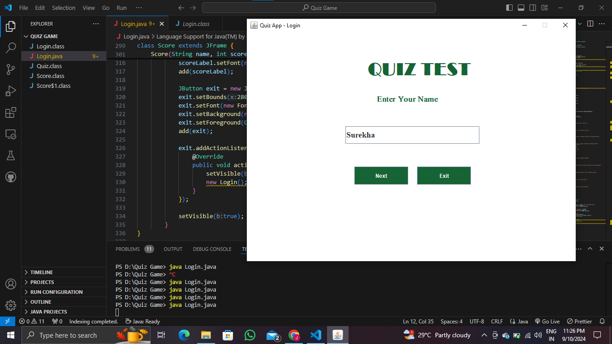
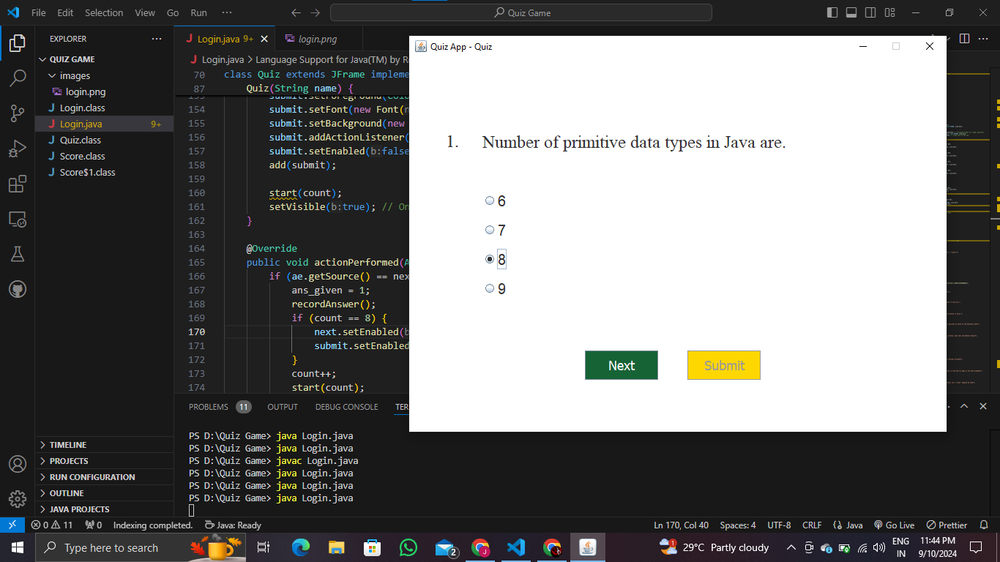
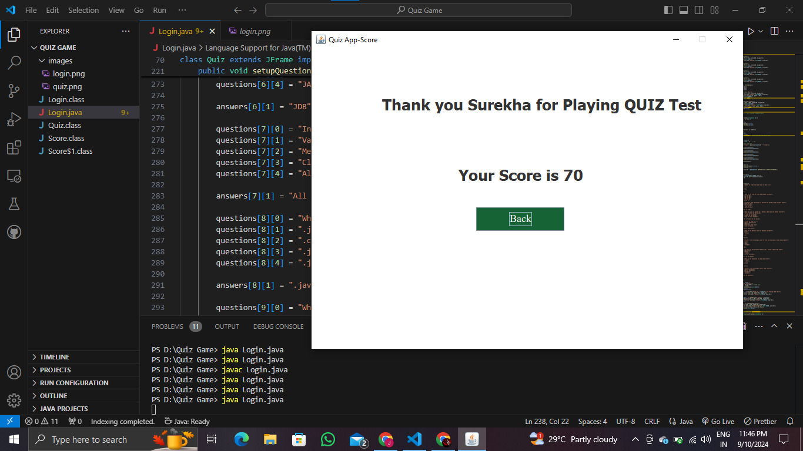

# Java Quiz Application

## Overview

The Java Quiz Application is a simple quiz application built using Java Swing. It features a login screen, a quiz with multiple-choice questions, and a score summary page. The application is designed to be user-friendly and visually appealing with a clean interface.

## Features

- **Login Screen**: Users enter their name to start the quiz.
- **Quiz Questions**: 10 multiple-choice questions with four options each.
- **Navigation**: Users can navigate through questions using "Next" and submit their answers.
- **Score Display**: Shows the final score at the end of the quiz.
- **User-Friendly Interface**: Custom buttons, labels, and formatted question display.

## Screenshots

### Login Screen


### Quiz Screen


### Score Screen


## Running the Application

1. **Compile the Code**: Ensure you have Java Development Kit (JDK) installed. Compile the Java files using the command:
    ```bash
    javac Login.java
    javac Quiz.java
    javac Score.java
    ```
2. **Run the Application**: Execute the main class to start the application:
    ```bash
    java Login
    ```

## Custom Components

- **`Login` Class**: Handles the login screen and user input.
- **`Quiz` Class**: Manages the quiz questions, options, and user responses.
- **`Score` Class**: Displays the final score and a thank you message.

## Dependencies

- Java SE Development Kit (JDK) 8 or above.

## Contributing

Contributions are welcome! If you have suggestions or improvements, please create an issue or submit a pull request.
